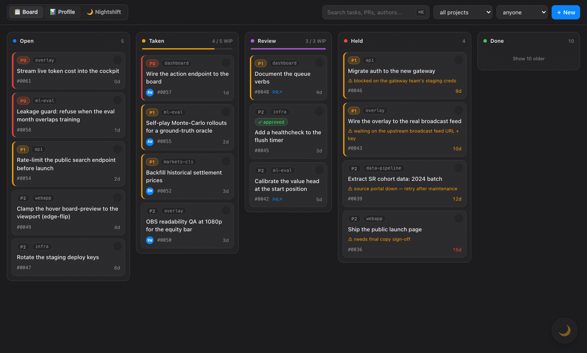

<h1 align="center">devbrain</h1>

<p align="center">
  <strong>A shared, git-synced memory layer for AI coding agents.</strong>
</p>

<p align="center">
  <a href="https://github.com/TheWeiHu/devbrain/releases"></a>
  <a href="https://github.com/TheWeiHu/devbrain/actions/workflows/test.yml"></a>
  <a href="https://github.com/TheWeiHu/devbrain/blob/main/LICENSE"></a>
  <a href="https://claude.ai/code"></a>
  <a href="https://developers.openai.com/codex"></a>
</p>

<p align="center">
  <a href="#how-it-works">How It Works</a>
  ·
  <a href="#install">Install</a>
  ·
  <a href="#daily-use">Daily Use</a>
  ·
  <a href="#nightshift">nightshift</a>
  ·
  <a href="DESIGN.md">Design</a>
</p>

<p align="center">
  
</p>

AI coding agents forget: close the chat, switch machines, or change tools, and everything
they learned is gone. devbrain gives every agent working on a repo the same durable project memory.

Every prompt you send is captured to a private, git-synced markdown store you own, then
distilled into a searchable brain and a task queue. The brain records *what happened*;
the queue records *what's next*. Markdown + git is the source of truth; everything else is
a rebuildable projection. Built for [Claude Code](https://claude.ai/code), with the same
workflows as skills in other agents (e.g. [Codex](https://openai.com/codex/)).

## How It Works

```
Brain        durable project memory, git-synced across every session and machine
 ├─ Capture     every prompt → raw markdown log     automatic, model-free · source of truth
 ├─ Distill     /distill → brain pages + queue      searchable, rebuildable
 ├─ Queue       what should happen next             one markdown file per task
 ├─ Sync        many agents, one brain              keyed by git remote
 └─ Nightshift  work the queue while you're away    grounded in current context
```

`devbrain install` wires Claude Code (and any other installed agents) on *this machine*: a
`UserPromptSubmit` hook logs every prompt verbatim, and a 5-minute timer commits and
pushes it to your configured remote. The log is keyed by the repo's **git remote**, so all
worktrees collapse to one project. devbrain is a single binary; your prompts and brain live
in a *separate* private store at `~/devbrain-data` that you own — nothing leaves your
machine until you add a remote or opt into embeddings. Full design in [`DESIGN.md`](DESIGN.md).

## Install

```bash
brew install TheWeiHu/devbrain/devbrain
devbrain install
```

No Homebrew? `go install github.com/TheWeiHu/devbrain/cmd/devbrain@latest` or grab a
[release tarball](https://github.com/TheWeiHu/devbrain/releases) and put `devbrain` on PATH.

`devbrain install` is idempotent and wires only *this machine*. In a terminal it asks
y/n per component; non-interactive runs take every default. When it finishes it opens
the browser dashboard (`devbrain dashboard` — Board · Nightshift · Profile). Common flags:

```bash
devbrain install --dry-run                     # preview every path it would touch; write nothing
devbrain install --explain                     # dry-run plus a one-line why per action
devbrain install --without nightshift          # skip the overnight loop
devbrain install --only capture                # just the prompt-capture hook
devbrain install --no-open                     # don't auto-open the dashboard
DEVBRAIN_DATA=~/path devbrain install          # store the brain elsewhere
devbrain config data-dir                       # show the exact path every component uses
```

**Search engine (optional).** Offline `devbrain brain search` needs nothing. For ranked
search, opt into `gbrain` — a separate local search engine (a global `bun add -g`, pinned
`gbrain@0.18.2`) — with `devbrain install --install-deps`. For *semantic* ranking — the
`gbrain query` path `/continue` prefers — set an OpenAI key and re-index:

```bash
export OPENAI_API_KEY=sk-...            # or: gbrain config set openai_api_key sk-...
devbrain rebuild                        # re-indexes pages and runs 'gbrain embed --stale'
```

Embedding sends page/log text to OpenAI's API — the one opt-in egress ([`SECURITY.md`](SECURITY.md)).
Core devbrain needs only your coding agent and Git — no python3, Node, or Bun; the
optional `gbrain` engine is the sole exception.

## Daily Use

| Command | What it does |
|---|---|
| *(automatic)* | every prompt captured; flusher commits and pushes every 5 min |
| **`/distill`** | fold new log → brain pages **and** queue tasks |
| **`/continue`** | resume from memory, then work the top queue task into a small PR |
| **`/work`** | work the top task into a small PR without refreshing memory first (for `/loop` + nightshift) |
| **`/loop /work`** | headless drain: one small PR per task |
| **`/loop /continue`** | interactive resume+drain: same, but folds new log into the brain each turn |
| **`/reconcile`** | mark brain facts the live repo contradicts (auto-runs ~daily) |
| **`/audit`** | spot-check recent delegated runs for protocol drift (auto-runs ~daily) |
| **`/journal`** | dated recap of the last N days across every project (cached per day) |
| **`/brain-retro`** | fill the journal cache, then run `devbrain retro` |
| `gbrain search` / `devbrain brain search` | query the brain from the shell (gbrain if installed, else offline grep) |
| `devbrain dashboard` | browser control plane for the queue (view · edit · prioritize · unblock) |
| `devbrain retro` | graded monthly report (journal + spend + queue) → `retro/<date>.html` |
| `devbrain help` | every devbrain subcommand |

The queue is one markdown file per task, priority-ranked; a task isn't `done` until its
PR merges. Agents without slash commands run the same workflows as skills (`$distill`,
`$continue`, `$work`, `$reconcile`, `$audit`).

## nightshift

Runs several `claude` workers in parallel against the queue, each in its own worktree,
grounded in current project memory, auto-merging green work onto a throwaway `nightshift`
branch — you wake to one `git diff main...nightshift`.

```bash
devbrain nightshift start ~/nightshift/myrepo   # launch the fleet (runs until stopped)
devbrain nightshift watch                       # live browser dashboard
devbrain nightshift stop                        # stop the fleet
```

It never merges to `main`. Installing it spawns nothing — the fleet runs only when you
start it, and it does autonomous git ops and spends real tokens, so point the first runs
at a throwaway. You stay the only `nightshift → main` gate.

## More

- [`DESIGN.md`](DESIGN.md) — architecture, the TODO queue, and the golden rule (never lose the log)
- [`SECURITY.md`](SECURITY.md) — what's captured, where it's stored, who can see it, how to report a vuln
- [`docs/privacy.md`](docs/privacy.md) — what an entry looks like, redaction gaps, how to delete/disable/audit your data
- `devbrain import` — seed the brain from your existing agent transcripts
- `make test` — run the full suite
- Re-run `devbrain install` anytime; it only adds what's missing. Tear down with `devbrain uninstall` (leaves your data untouched).
